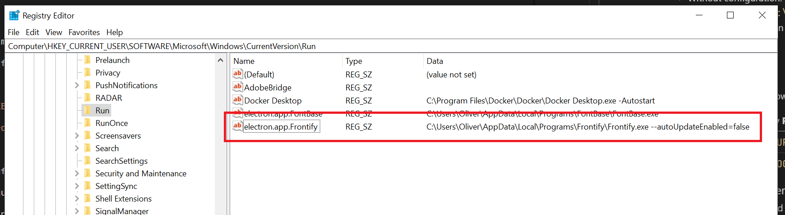

# Frontify for Desktop

## Table of contents

- [Configuration Options](#configuration-options)
  - [Commandline arguments](#commandline-arguments)
  - [Configuration file](#configuration-file)
- [Windows](#windows)
  - [Installation options](#installation-options)
  - [Autostart options](#autostart-options)
  - [Registry entries](#registry-entries)
  - [Deployment in an enterprise environment](#deployment-in-an-enterprise-environment)
- [macOS](#macos)

## Configuration Options

These configuration options can be used to control the app's behavior or restrict some user actions. They can be passed as [commandline arguments](#commandline-arguments) to the executable or can be specified in a dedicated [configuration file](#configuration-file).

| Option name         | Description                                                                                                                                                                 |
| ------------------- | --------------------------------------------------------------------------------------------------------------------------------------------------------------------------- |
| `applicationName`   | This name will be shown when hovering over the tray icon and as window title                                                                                                |
| `domain`            | This is the domain the user should connect to, without "https://". If this option is set, the user won't be able to connect to another Frontify instance.                   |
| `brandId`           | This is the id of the brand that you want the user to connect to. If this option is specified the user won't be able to choose another brand in your environment.           |
| `autoUpdateEnabled` | With this option enabled, the user is allowed to download and install updates on his own (requires administrator rights on Windows depending on the installation location). |
| `autostartApp`      | By default the app will register itself as an autostart application. If you don't want the app to automatically start when the user logs in you can set this to `false`.    |
| `includeGuidelines` | An array of guideline ids which should be included in the dropdown when changing the search scope.                                                                          |
| `includeDocuments`  | An array of guideline ids which should be included in the dropdown when changing the search scope. This option will be ignored when `includeGuidelines` is specified.       |
| `includeProjects`   | An array of document ids which should be included in the dropdown when changing the search scope.                                                                           |
| `excludeGuidelines` | An array of document ids which should be excluded from the dropdown when changing the search scope. This option will be ignored when `includeDocuments` is specified.       |
| `excludeDocuments`  | An array of project ids which should be excluded from the dropdown when changing the search scope.                                                                          |
| `excludeProjects`   | An array of project ids which should be excluded from the dropdown when changing the search scope. This option will be ignored when `includeProjects` is specified.         |

### Commandline Arguments

Here are example how you can pass the configuration options via commandline arguments:

| Operating system | Example                                                                                                                 |
| ---------------- | ----------------------------------------------------------------------------------------------------------------------- |
| Windows          | `PS> .\Frontify.exe --domain=brand.frontify.com --autoUpdateEnabled=false brandId=1 --excludeProjects=1,2,3`            |
| macOS            | `$ open -a Frontify.app --args --domain=brand.frontify.com --autoUpdateEnabled=false brandId=1 --excludeProjects=1,2,3` |

’¨

### Configuration File

The configuration file must be located under:

- Windows: `%APPDATA%\Frontify Companion\application-configuration.json`
- macOS: `~/Library/Application Support/Frontify Companion/application-configuration.json`

Here is an example JSON configuration file:

```json
{
  "domain": "brand.frontify.com",
  "autoUpdateEnabled": false,
  "brandId": 1,
  "excludeProjects": [1, 2, 3]
}
```

If you're using Frontify for Desktop v1.x.x please check out our [legacy customization options](legacy-customization-options.md).

## Windows

### Installation options

If you want to run an automated installation with a Script it's recommended to run the installer with the "silent" option. Additionally, you can specify the installation location.

Here is an example using Powershell:

```
PS> .\Frontify-Setup-2.0.0.exe /S /D="C:\Program Files\Frontify"
```

| Commandline option | Description                                                             |
| ------------------ | ----------------------------------------------------------------------- |
| `/S`               | Runs the installer in the background without any installation dialog    |
| `/D="<PATH>"`      | Specifies the installation location (requires Administrator privilege). |

### Autostart options

By default, the application will register itself in the Windows registry for autostart when it's started for the first time. If you want to make the application to start up automatically without the user having to start the application you can create the following entry in the Windows registry:

- Location: `HKEY_CURRENT_USER\Software\Microsoft\Windows\CurrentVersion\Run`
- Name: `electron.app.Frontify`
- Data:
  - Without configuration: `C:\Program Files\Frontify\Frontify.exe` (your installation path may vary)
  - With configuration: `C:\Program Files\Frontify\Frontiy.exe --domain=brand.frontify.com --brandId=1` (your installation path and configuration arguments may vary)

Here is an example:



### Registry entries

Depending on if you have installed the app only for the current user or for all users the app will add Windows registry entries in the following locations:

| Installation location | Registry Path                                                      |
| --------------------- | ------------------------------------------------------------------ |
| Current user          | `HKEY_CURRENT_USER\Software\Microsoft\Windows\CurrentVersion\Run`  |
| All users             | `HKEY_LOCAL_MACHINE\Software\Microsoft\Windows\CurrentVersion\Run` |

### Deployment in an enterprise environment

Here is a short guide how we would recommend deploying the app in your enterprise environment.

1. [Download](https://github.com/frontify/frontify-companion-release/releases/latest) the latest `.exe` or `.msi` installer.
2. Install the application on the user's machine using a Powershell or Batch script in silent mode:
   ```
   PS> .\Frontify-Setup-2.0.0.exe /S /D="C:\Program Files\Frontify"
   ```
3. The installer will most likely create a shortcut on the desktop and in the Windows start menu. As we assume that your employees are not familiar with the name "Frontify" we recommend removing these shortcuts and creating custom shortcuts.
4. Create a new shortcut in `C:\ProgramData\Microsoft\Windows\Start Menu\Programs`. The target of the shortcut should point to `C:\Program Files\Frontify\Frontify.exe`. This shortcut will show up in the user's start menu. Change the name of the shortcut to something your employees will recognize as your brand portal.
5. We recommend adding a predefined domain so your employees don't have to type in your brand domain manually. To do so change the shortcut's target to this: `C:\Program Files\Frontify\Frontify.exe --domain=<YOUR_DOMAIN>`
6. As we assume that your average Windows user doesn't have privileges to install applications on the computer we recommend turning off the auto update mechanism. Change the shortcut's target to `C:\Program Files\Frontify\Frontify.exe --domain=<YOUR_DOMAIN> --autoUpdateEnabled=false`
7. Check the full documentation on all available [configuration options](#configuration-options) which can be used to control the app's behavior.
8. If possible you can also change the shortcut's icon to your brand logo so your users will recognize the app. [Here](./example-windows-app-icon.ico) is an example `.ico` file that you could use as a reference.
9. If you want the application to start automatically when your users log in on Windows the next time check [this](#autostart-options) guide.
10. Done.

## macOS

This is a short guide how to deploy the application in an enterprise macOS environment.

1. [Download](https://github.com/frontify/frontify-companion-release/releases/latest) the latest `.dmg` installer.
2. Install the application on the user's computer under `/Applications/Frontify.app`.
3. If you want the application to automatically start when the user logs in the next time use this command to register it in the login items:

   ```bash
   $ osascript -e 'tell application "System Events" to make login item at end with properties {path:"/Applications/Frontify.app", hidden:false}'

   ```

4. Unfortunately on macOS it's not possible to pass commandline arguments to an application when it's started automatically by the operating system. In case you want to change the app's default behavior with the available [configuration options](#configuration-options), you have to create a separate [configuration file](#configuration-file) **for each user**.
5. Create the following directory in the user's home directory:

   ```bash
   $ mkdir ~/Library/Application\ Support/Frontify\ Companion
   ```

6. Write your configuration in JSON syntax to the file `application-configuration.json`

   ```bash
   $ echo '{"domain":"brand.frontify.com"}' > ~/Library/Application\ Support/Frontify\ Companion/application-configuration.json
   ```

7. Done.
